# LandVeda

## Full Stack Land & Property Management System

LandVeda is a modern full-stack web application developed to simplify land and property management through a centralized platform. It enables efficient management of clients, properties, documents, enquiries, and administrative operations.

## Features

- User Authentication
- Admin Dashboard
- Client Management
- Property Management
- Document Management
- File Upload
- OTP Login
- REST APIs
- Responsive User Interface

## Tech Stack

### Frontend

- React.js
- Bootstrap 5
- JavaScript
- HTML5
- CSS3
- Axios

### Backend

- Java
- Spring Boot
- Spring MVC
- Spring Data JPA
- REST APIs

### Database

- MySQL

### Tools

- Git
- GitHub
- Maven
- VS Code
- Eclipse

## Project Structure

```text
LAND_VEDA
│
├── backend
│   ├── src
│   ├── pom.xml
│
├── frontend
│   ├── src
│   ├── public
│
└── README.md
```

---

## Installation

### Backend

```bash
cd backend
mvn spring-boot:run
```

### Frontend

```bash
cd frontend
npm install
npm run dev
```

## Project Workflow

1. Client registers using a mobile number.
2. OTP verification is completed.
3. Client logs into the dashboard.
4. Admin manages client accounts.
5. Clients upload property-related documents.
6. Admin reviews and manages uploaded documents.
7. Clients can access and download approved documents.

## Future Enhancements

- Property Image Gallery
- Google Maps Integration
- SMS OTP Service
- Email Notifications
- Payment Gateway
- Advanced Search & Filters
- Role-Based Access Control
- Cloud Storage Integration

## Application Screenshots

### Home Page

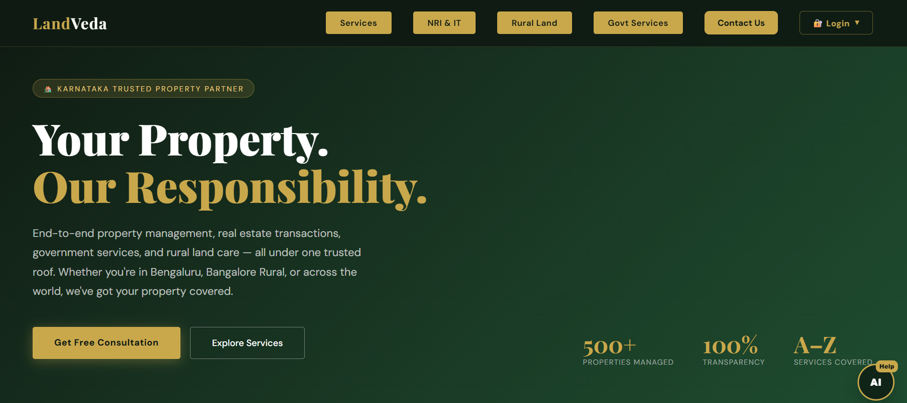

### Services

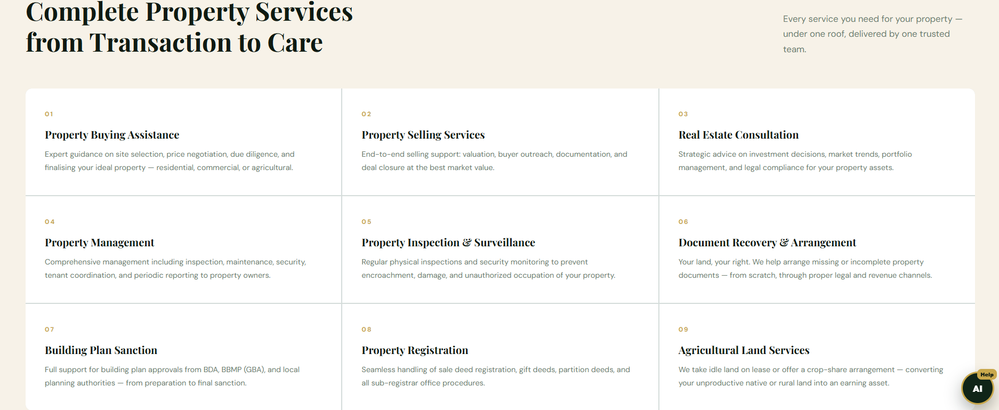

### NRI Services


### Rural Services

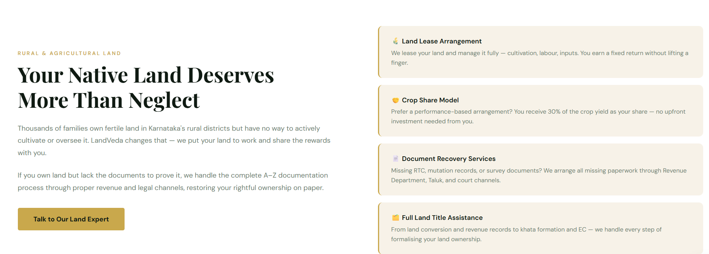

### Government Services

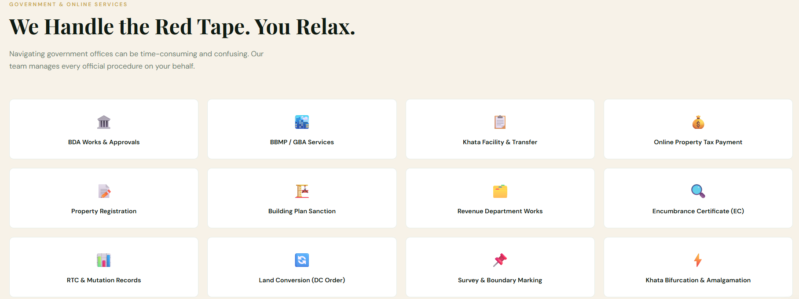

### Process

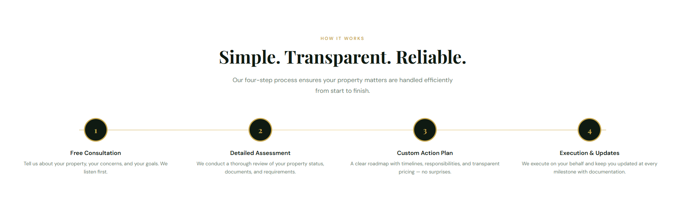

### Contact Form

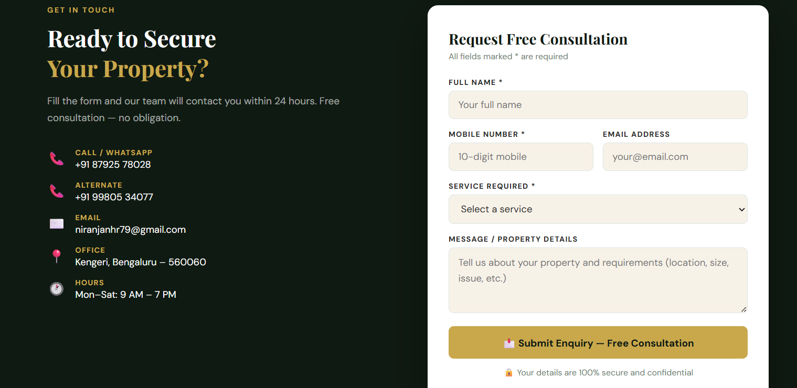

### Register

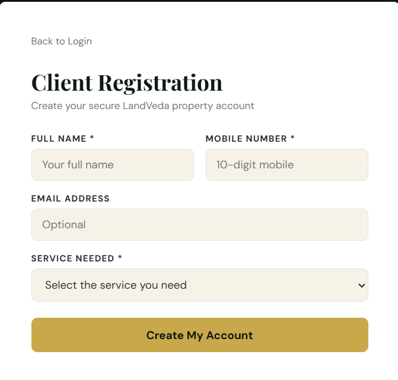

### Client Login

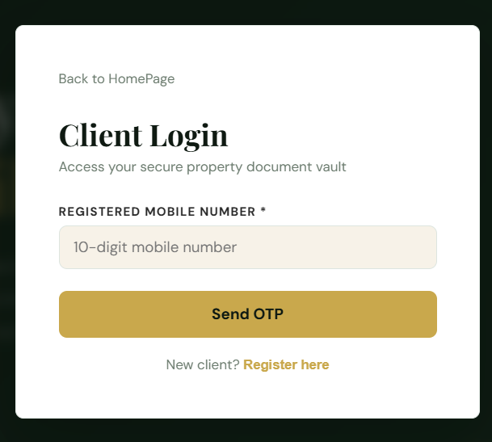

### Admin Login

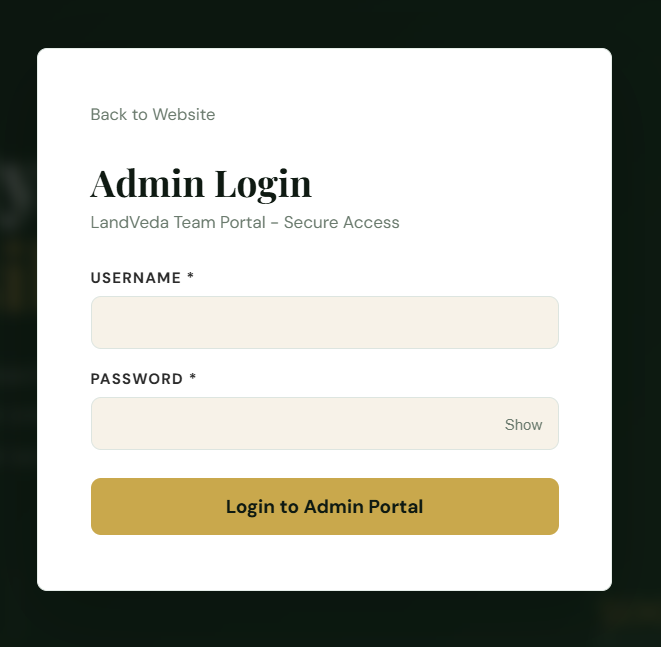

### Client Dashboard

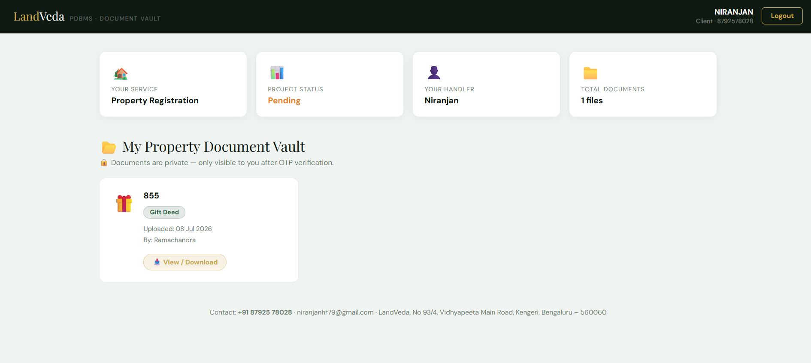

### Admin Dashboard

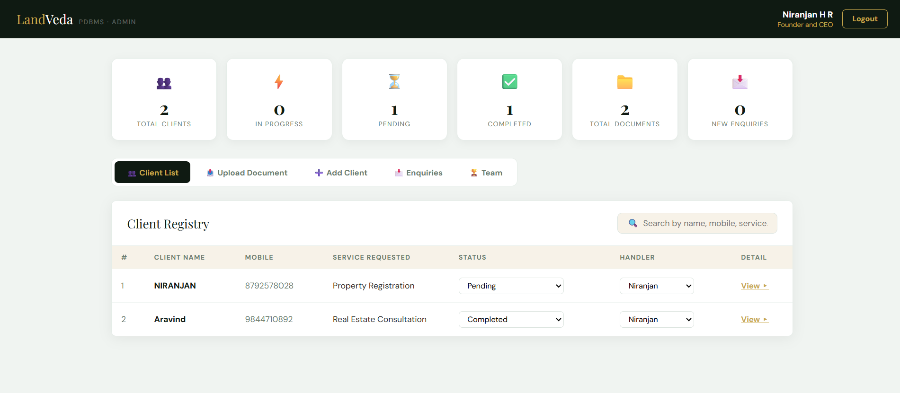

### Upload Document


## Developer

**Niranjan H R**

Java Full Stack Developer

GitHub:
https://github.com/niranjanhr27

LinkedIn:
www.linkedin.com/in/niranjanhr27
